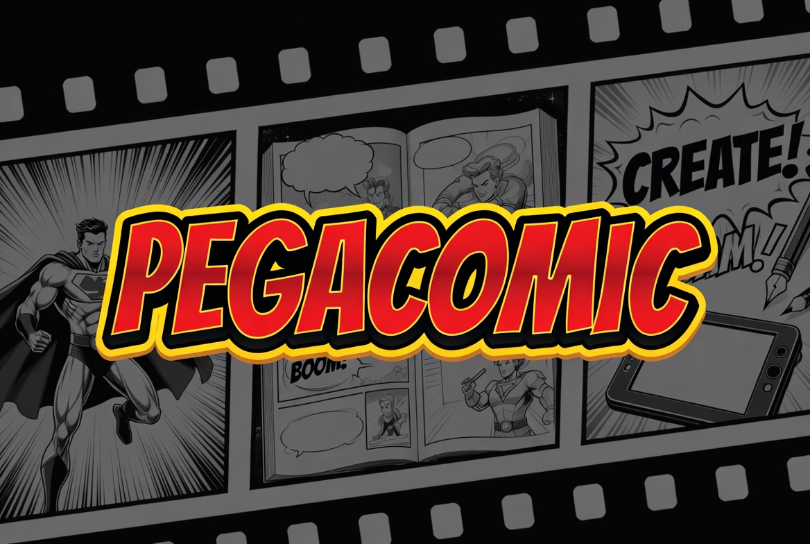
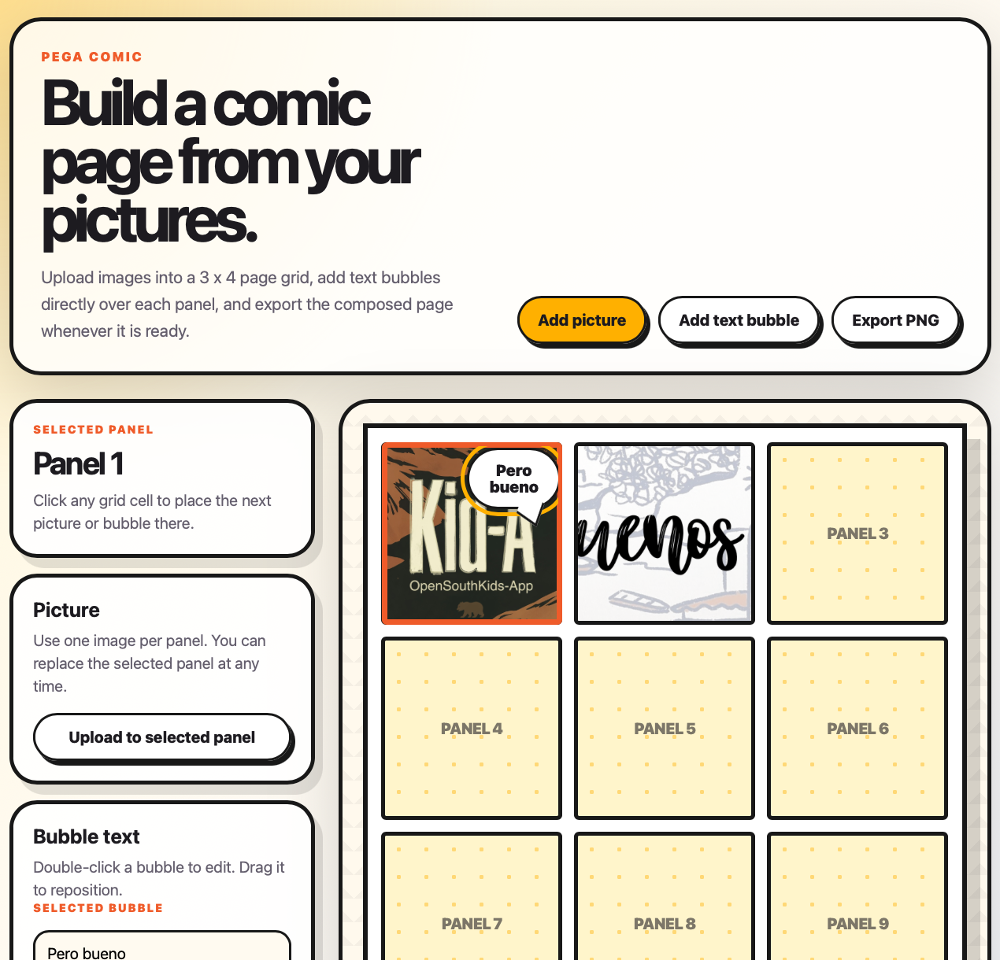

# Pega Comic

A small static web app to build comic pages from pictures: place images in a 3 x 4 grid, add speech bubbles, and export the composed page.

Built for **OpenSouthKids 2026**, held during **OpenSouthCode** in Malaga, Spain.

## Use

Open `index.html` locally, or visit https://pablonete.github.io/pegacomic/.

## First version

Screenshot

## License

MIT
